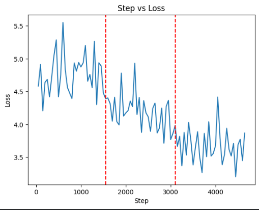
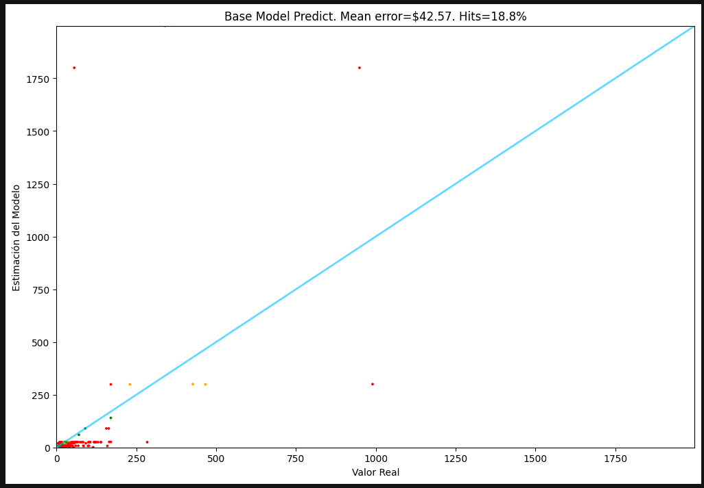
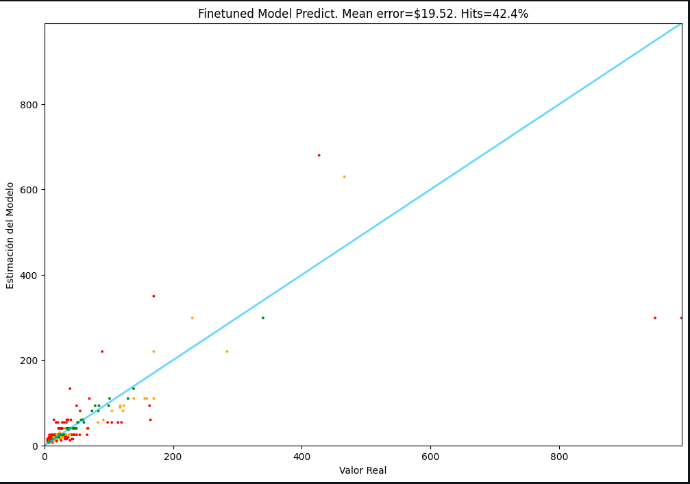
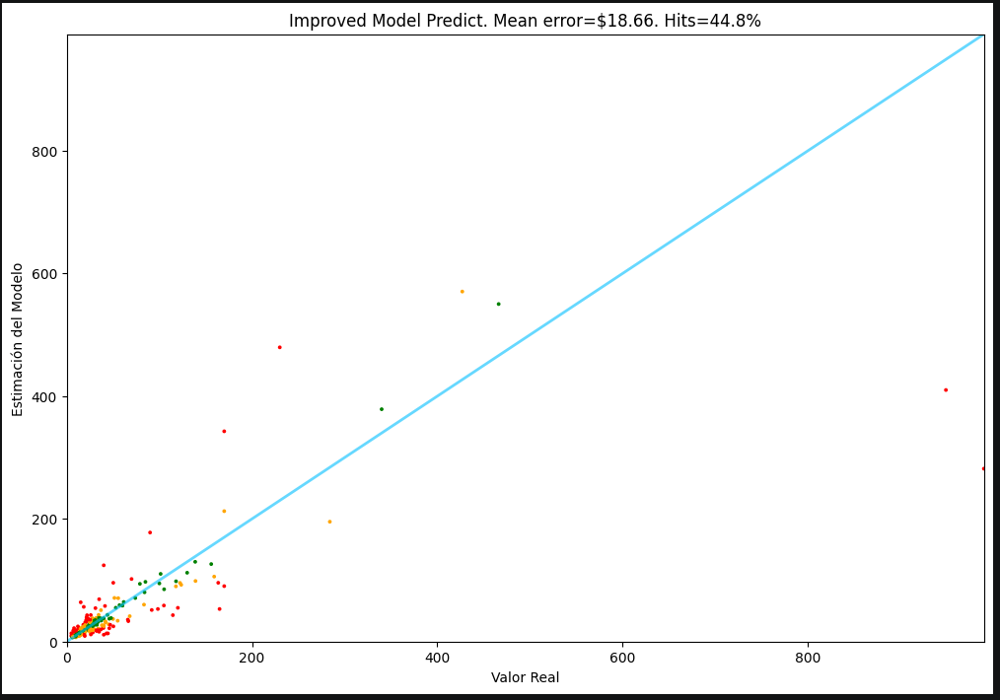

# LLM para la predicción de precios de productos de Amazon. 
Ajuste fino eficiente de un modelo de lenguaje de 8B parametros para estimar el precio de un producto a partir de su descripcion en texto plano.

## Que resuelve
Estimar el precio de un producto es un problema real en e-commerce: hacerlo manualmente escala mal y depende de criterios subjetivos. Este proyecto demuestra que un LLM de propósito general como LLaMA 3.1 puede especializarse en esa tarea numérica sin reentrenar desde cero, usando una fracción del computo original.

Una vez entrenado un modelo especializado, la pregunta clave es: cuánto mejor predice respecto al modelo original? Este proyecto responde esa pregunta de forma rigurosa, evaluando ambos modelos sobre 250 productos del conjunto de test y midiendo no sólo el error promedio sino la tasa de aciertos reales. Además, propone y valida una estrategia de inferencia mejorada que aprovecha la distribución de probabilidad del modelo para dar estimaciones más precisas.

## Funcionalidades
- Ajuste fino supervisado de `meta-llama/Meta-Llama-3.1-8B` sobre un dataset de productos con precios reales. El dataset se compone de 25k productos de Amazon en la categoría de electrodomésticos y sus costos son de hasta 99 dólares. El dataset fue descargado de Hugging Face (y filtrado con precio menor a 99 USD) en la ruta McAuley-Lab/Amazon-Reviews-2023 en la categoría de "Appliances", esta descarga y posterior filtración se guardó nuevamente en HF.
- Cuantizacion a 4 bits (QLoRA) para entrenar en GPU (A100) sin degradar la calidad del modelo.
- Enmascaramiento de completación: el modelo aprende sólo a predecir el precio, no a repetir la descripción.
- Guardado automático de checkpoints en Hugging Face Hub cada 500 steps.
- Predicción y comparación de `meta-llama/Meta-Llama-3.1-8B` base contra su versión ajustada (via PEFT/LoRA).
- Evaluacion sobre 250 elementos del conjunto de test con reporte de Error Medio, RMSLE y tasa de "Hits".
- Clasificación visual de predicciones por semáforo: verde (<20% de error), naranja (<40%), rojo (>40%).
- Estrategia de inferencia mejorada: promedio ponderado de los 3 tokens mas probables via softmax.
- Gráficas scatter (valor real vs. estimación del modelo) para comparar visualmente los tres enfoques.
  
## Como funciona
* En el notebook de entrenamiento:
  
El pipeline aplica **QLoRA** (Quantized Low-Rank Adaptation): el modelo base se carga en **4 bits** (BitsAndBytes), reduciendo la memoria de ~16 GB a ~5 GB. Sobre el modelo congelado se encajan **matrices LoRA de rango 32** en las cuatro capas de atencion (`q_proj`, `v_proj`, `k_proj`, `o_proj`), que son los únicos pesos que se actualizan durante el entrenamiento.

El dataset `PamAmezcua/lite-data` contiene ejemplos con formato:
```
<descripcion del producto>
Price is $<precio>
```

Se usa `DataCollatorForCompletionOnlyLM` para enmascarar todo lo anterior a `"Price is $"`, de modo que la única predicción que deberá hacer el modelo es del precio, no de texto.

El entrenamiento corre durante **3 epocas** con `SFTTrainer` de la libreria TRL, usando el optimizador `paged_adamw_32bit` y un scheduler de tasa de aprendizaje tipo coseno con warmup del 3%.

* En el notebook de predicción:
  
Se carga el modelo base cuantizado a 4 bits y luego se le aplican los **adaptadores LoRA** del modelo ajustado mediante `PeftModel.from_pretrained`, especificando el commit exacto de HF Hub para reproducibilidad. Ambos modelos comparten el mismo tokenizador y el modelo preentrenado pesa sólo 109MB más que el modelo base.

Para cada producto del test, el prompt tiene la forma:

```
<descripcion del producto>
Price is $
```

El modelo genera hasta 3 tokens nuevos; se extrae el número con una expresión regular aplicada sobre `"Price is $"`. La clase `Tester` contiene la lógica de evaluación: calcula el error absoluto, el **Squared Log Error (SLE)** y clasifica cada predicción por color segun su error relativo respecto al precio real.

Se propone una **estrategia mejorada** para la evaluación, en la cual se consideran los 3 tokens numéricos con mayor probabilidad ponderando por su peso. Esto es posible porque LLaMA tokeniza cualquier número menor de 3 digitos como un único token (es por ello que se escogió este modelo para tareas de predicción y que se escogieron precios menores a 100 USD, pues a partir del 100, los números se descomponen en dos tokens o más).

### Arquitectura

```
Dataset (HF Hub)
      |
      v
  Tokenizador (LLaMA tokenizer)
      |
      v
  Modelo Base congelado (LLaMA 3.1 8B, 4-bit NF4)
  + Matrices LoRA entrenables (rango 32, alpha 64)
      |
      v
  SFTTrainer (mascara: solo aprende "Price is $___")
      |
      v
  Checkpoints --> Hugging Face Hub (privado)
      |
      v
  Registro de loss
      |
      v
  Predicción del modelo base y finetuneado sobre conjunto de test
      |
      v
  Comparación de métricas relacionadas a la predicción entre ambos modelos. 

```


## Stack técnico
| | |
|---|---|
| **Lenguaje:** | Python 3.11 (Google Colab, GPU T4/A100)|
| **Modelo base:** | `meta-llama/Meta-Llama-3.1-8B` |
| **Modelo ajustado:** | `PamAmezcua/pricer-2026-06-11_13.31.28`  en HF Hub| 
| **Tecnica de fine-tuning:** | QLoRA (PEFT + BitsAndBytes + TRL) |
| **Librerias clave:** | `transformers 4.43`, `trl 0.9.6`, `peft 0.12`, `accelerate`, `bitsandbytes`, `datasets`, `wandb` |
| **Almacenamiento del modelo:** | Hugging Face Hub |


## Correr en Colab
```python
# Para el notebook de entrenamiento:
# 1. Abrir el notebook Fine_tuning_modelo_predictivo.ipynb en Google Colab

# 2. Agregar los secretos en Colab (icono de llave en el panel izquierdo):
#    HF_TOKEN      → tu token de lectura/escritura de Hugging Face
#    WANDB_API_KEY → tu API key de Weights & Biases

# 3. Instalar dependencias (primera celda del notebook)
!pip install -q datasets==2.21.0 transformers==4.43.1 trl==0.9.6 peft==0.12.0 accelerate==0.32.1 bitsandbytes triton==3.1.0
!pip install numpy==1.26.4 --force-reinstall

# 4. Ejecutar todas las celdas en orden
# El entrenamiento completo (3 epocas, ~75k steps) tarda ~1:20 horas en una A100.
# Los checkpoints se guardan automaticamente en tu repositorio de HF cada 500 steps.

# Para el notebook de predicciones:
# Prerequisito: haber ejecutado Fine_tuning_modelo_predictivo.ipynb para que el modelo ajustado exista en tu HF Hub.

# 1. Abrir Prediccion_de_precios.ipynb en Google Colab

# 2. Agregar el secreto en Colab (icono de llave):
#    HF_TOKEN → tu token de Hugging Face (lectura)

# 3. Instalar dependencias (primera celda del notebook)
!pip install -q datasets==2.21.0 transformers==4.43.1 trl==0.9.6 peft==0.12.0 accelerate==0.32.1 bitsandbytes triton==3.1.0
!pip install numpy==1.26.4 --force-reinstall

# 4. Ajustar en la celda de configuracion:
#    RUN_NAME  → el timestamp de tu run de entrenamiento (ej. "2026-06-11_13.31.28")
#    REVISION  → el hash del commit de HF Hub que quieres evaluar
#                (o dejar REVISION = None para usar el último checkpoint)

# 5. Ejecutar todas las celdas en orden.
# La evaluacion de 250 items tarda ~10 minutos en una T4.

```

## Resultados

<p>
  Gráfica de pérdida en comparación con el step del entrenamiento, las líneas rojas muestran la separación entre épocas. Se puede percibir que a pesar de los picos la gráfica es cada vez más decreciente conforme transcurre cada época.
  
  
  <br><br>
  
  Gráfica y métricas de la predicción con el modelo base.
  
   
   <br><br>
   
   Gráfica y métricas de la predicción con el modelo finetuneado. Note la mejora en la predicción.
   
  
   <br><br>
   
   Gráfica y métricas de la predicción con el modelo finetuneado y mejorando la metodología de predicción (promedio ponderado de los tres tokens más probables)
  
  
   
</p>

## Qué aprendí:
- Cuantizacion 4-bit no es trivial, configurar correctamente `bnb_4bit_quant_type="nf4"` redujo el uso de memoria ~3x sin impactar la convergencia, pero requiere entender la diferencia entre tipos de cuantizacion (nf4 vs fp4) y como `bfloat16` actua como tipo de computo intermedio. Así mismo de debe de analizar qué GPU utilizar según los requerimientos de memoria del modelo.
- Elección de los hiperparámetros adecuados del entrenamiento, fundamental para determinar cuánto tiempo tardará en reentrenarse el modelo y en función de eso calcular el costo de las unidades computacionales requeridas para dicha tarea. Igualmente, como los tiempos de entrenamiento son largos, se debe preveer previamente la plataforma que será de utilidad para guardar cada cierto número de steps los entrenamientos de las matrices Loora.
- El enmascaramiento es critico en SFT: sin `DataCollatorForCompletionOnlyLM`, el modelo aprende a reproducir las descripciones en lugar de predecir precios.
- Se pueden generar mejores estrategias de predicción, por ejemplo promediar los 3 tokens numéricos más probables por su peso softmax reduce el error en casos donde el modelo "duda" entre precios cercanos, sin ningun costo de entrenamiento adicional.
- RMSLE penaliza errores relativos, no absolutos. Un error de $50 en un producto de $100 es mucho mas grave que el mismo error en uno de $1000. Usar RMSLE en lugar de MAE o RMSE alinea la métrica.
- Fijar el commit de HF Hub es esencial para reproducibilidad: sin `REVISION`, cada vez que se evalua se carga el ultimo checkpoint, que puede ser un punto intermedio del entrenamiento. Anclar el commit garantiza que los resultados reportados corresponden siempre al mismo modelo. Así mismo, si apartir de algún punto de las épocas se empieza a detectar overfitting, se puede escoger el commit exacto previo al sobre ajuste que nos brinde matrices loora más certeras.
- Escoger un tokenizador correcto según la tarea que queramos hacer.
